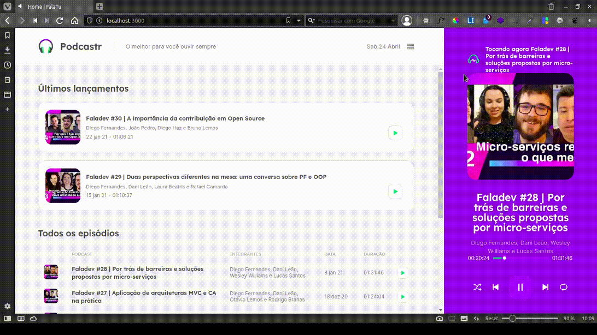
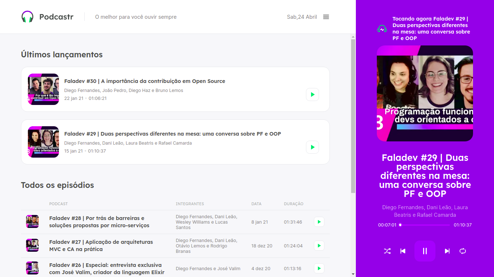
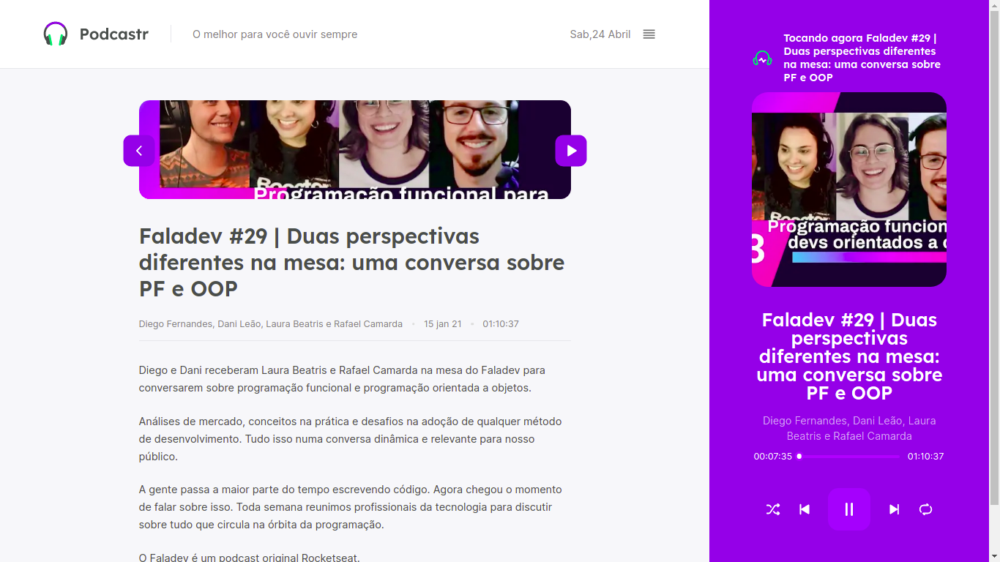

<h1> Um pouco sobre o projeto</h1>

    FaltaTu é um web site onde você pode ouvir os seus podcast favoritos

<h1>Demonstração</h1>

    Acima podemos ver o que a execução de um podcast e um pouco sobre o controle deste

<h2> Telas complementares</h2>

    Essa é a tela inicial que o usuário irá ver quando acessar a aplicação

    A tela que o usuário irá ver quando clicar em um dos episódios

